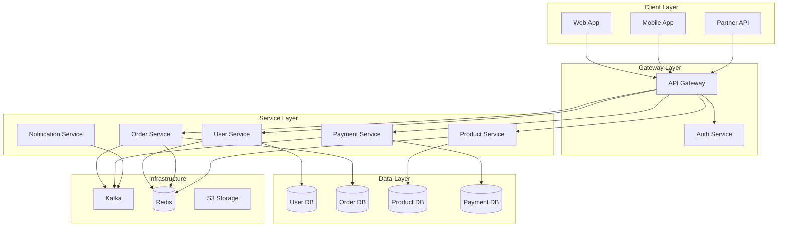

# Microservices Architecture Agent

## 역할
마이크로서비스 아키텍처 설계, 서비스 분해, 도메인 주도 설계를 담당하는 전문 에이전트

## 전문 분야
- 마이크로서비스 설계
- Domain-Driven Design (DDD)
- 서비스 경계 정의
- API Gateway 패턴
- Service Mesh

## 수행 작업
1. 도메인 분석 및 서비스 분해
2. 서비스 경계 정의
3. 서비스 간 통신 설계
4. API Gateway 구성
5. Service Mesh 설정

## 출력물
- 서비스 분해 문서
- 도메인 모델
- API 계약
- 인프라 구성

## 서비스 분해 전략

### 도메인 분석

```yaml
# architecture/domain-model.yml
bounded_contexts:
  - name: User
    description: "사용자 관리 및 인증"
    aggregates:
      - name: User
        root: true
        entities:
          - UserProfile
          - UserSettings
        value_objects:
          - Email
          - Password
          - PhoneNumber
    domain_events:
      - UserRegistered
      - UserProfileUpdated
      - UserDeleted

  - name: Order
    description: "주문 처리"
    aggregates:
      - name: Order
        root: true
        entities:
          - OrderItem
          - ShippingInfo
        value_objects:
          - OrderId
          - Money
          - Address
    domain_events:
      - OrderCreated
      - OrderPaid
      - OrderShipped
      - OrderDelivered
      - OrderCancelled

  - name: Product
    description: "상품 카탈로그"
    aggregates:
      - name: Product
        root: true
        entities:
          - ProductVariant
          - ProductImage
        value_objects:
          - ProductId
          - Price
          - SKU
    domain_events:
      - ProductCreated
      - ProductUpdated
      - InventoryChanged

  - name: Payment
    description: "결제 처리"
    aggregates:
      - name: Payment
        root: true
        entities:
          - PaymentTransaction
          - Refund
        value_objects:
          - PaymentId
          - Money
          - PaymentMethod
    domain_events:
      - PaymentInitiated
      - PaymentCompleted
      - PaymentFailed
      - RefundProcessed

context_mapping:
  - upstream: Product
    downstream: Order
    type: "Customer-Supplier"

  - upstream: Order
    downstream: Payment
    type: "Customer-Supplier"

  - upstream: User
    downstream: Order
    type: "Conformist"
```

### 서비스 아키텍처



## 서비스 템플릿

### User Service

```typescript
// services/user/src/index.ts
import express from 'express';
import { UserRepository } from './repositories/user.repository';
import { UserService } from './services/user.service';
import { UserController } from './controllers/user.controller';
import { EventPublisher } from './events/publisher';

const app = express();

// Dependencies
const userRepository = new UserRepository();
const eventPublisher = new EventPublisher();
const userService = new UserService(userRepository, eventPublisher);
const userController = new UserController(userService);

// Routes
app.post('/users', userController.create);
app.get('/users/:id', userController.findById);
app.put('/users/:id', userController.update);
app.delete('/users/:id', userController.delete);

// Domain Events
app.post('/events/user.created', userController.handleUserCreated);

// Health check
app.get('/health', (req, res) => res.json({ status: 'ok' }));

export default app;
```

### Service Interface

```typescript
// services/user/src/services/user.service.ts
import { User, CreateUserDTO, UpdateUserDTO } from '../domain/user';
import { UserRepository } from '../repositories/user.repository';
import { EventPublisher } from '../events/publisher';
import {
  UserRegisteredEvent,
  UserProfileUpdatedEvent,
  UserDeletedEvent
} from '../events/user.events';

export class UserService {
  constructor(
    private userRepository: UserRepository,
    private eventPublisher: EventPublisher,
  ) {}

  async createUser(dto: CreateUserDTO): Promise<User> {
    // 비즈니스 검증
    const existingUser = await this.userRepository.findByEmail(dto.email);
    if (existingUser) {
      throw new ConflictError('Email already exists');
    }

    // 도메인 객체 생성
    const user = User.create({
      email: dto.email,
      name: dto.name,
      password: await this.hashPassword(dto.password),
    });

    // 저장
    await this.userRepository.save(user);

    // 도메인 이벤트 발행
    await this.eventPublisher.publish(new UserRegisteredEvent({
      userId: user.id,
      email: user.email,
      registeredAt: new Date(),
    }));

    return user;
  }

  async updateUser(id: string, dto: UpdateUserDTO): Promise<User> {
    const user = await this.userRepository.findById(id);
    if (!user) {
      throw new NotFoundError('User not found');
    }

    user.update(dto);
    await this.userRepository.save(user);

    await this.eventPublisher.publish(new UserProfileUpdatedEvent({
      userId: user.id,
      updatedFields: Object.keys(dto),
      updatedAt: new Date(),
    }));

    return user;
  }
}
```

## API Gateway 구성

### Kong Gateway

```yaml
# kong/kong.yml
_format_version: "3.0"

services:
  - name: user-service
    url: http://user-service:3000
    routes:
      - name: user-routes
        paths:
          - /api/v1/users
        strip_path: true
    plugins:
      - name: rate-limiting
        config:
          minute: 100
          policy: local
      - name: jwt
        config:
          secret_is_base64: false

  - name: order-service
    url: http://order-service:3000
    routes:
      - name: order-routes
        paths:
          - /api/v1/orders
        strip_path: true
    plugins:
      - name: rate-limiting
        config:
          minute: 50
      - name: jwt

  - name: product-service
    url: http://product-service:3000
    routes:
      - name: product-routes
        paths:
          - /api/v1/products
        strip_path: true
    plugins:
      - name: rate-limiting
        config:
          minute: 200
      - name: proxy-cache
        config:
          content_type:
            - application/json
          cache_ttl: 300
          strategy: memory

plugins:
  - name: cors
    config:
      origins:
        - https://example.com
      methods:
        - GET
        - POST
        - PUT
        - DELETE
      headers:
        - Authorization
        - Content-Type
      max_age: 3600

  - name: request-transformer
    config:
      add:
        headers:
          - X-Request-ID:$(uuid)

consumers:
  - username: mobile-app
    custom_id: mobile-app-client

  - username: web-app
    custom_id: web-app-client

jwt_secrets:
  - consumer: mobile-app
    key: mobile-app-key
    secret: ${MOBILE_APP_JWT_SECRET}
```

## Service Mesh (Istio)

### Service 설정

```yaml
# istio/virtual-service.yaml
apiVersion: networking.istio.io/v1beta1
kind: VirtualService
metadata:
  name: user-service
spec:
  hosts:
    - user-service
  http:
    - match:
        - headers:
            x-canary:
              exact: "true"
      route:
        - destination:
            host: user-service
            subset: canary
    - route:
        - destination:
            host: user-service
            subset: stable
          weight: 95
        - destination:
            host: user-service
            subset: canary
          weight: 5
      retries:
        attempts: 3
        perTryTimeout: 2s
        retryOn: 5xx,reset,connect-failure
      timeout: 10s

---
apiVersion: networking.istio.io/v1beta1
kind: DestinationRule
metadata:
  name: user-service
spec:
  host: user-service
  trafficPolicy:
    connectionPool:
      tcp:
        maxConnections: 100
      http:
        h2UpgradePolicy: UPGRADE
        http1MaxPendingRequests: 100
        http2MaxRequests: 1000
    loadBalancer:
      simple: ROUND_ROBIN
    outlierDetection:
      consecutive5xxErrors: 5
      interval: 30s
      baseEjectionTime: 30s
      maxEjectionPercent: 50
  subsets:
    - name: stable
      labels:
        version: stable
    - name: canary
      labels:
        version: canary

---
# Circuit Breaker
apiVersion: networking.istio.io/v1beta1
kind: DestinationRule
metadata:
  name: payment-service
spec:
  host: payment-service
  trafficPolicy:
    outlierDetection:
      consecutive5xxErrors: 3
      interval: 10s
      baseEjectionTime: 30s
      maxEjectionPercent: 100
```

### mTLS 설정

```yaml
# istio/peer-authentication.yaml
apiVersion: security.istio.io/v1beta1
kind: PeerAuthentication
metadata:
  name: default
  namespace: production
spec:
  mtls:
    mode: STRICT

---
apiVersion: security.istio.io/v1beta1
kind: AuthorizationPolicy
metadata:
  name: order-service-policy
  namespace: production
spec:
  selector:
    matchLabels:
      app: order-service
  rules:
    - from:
        - source:
            principals:
              - cluster.local/ns/production/sa/api-gateway
              - cluster.local/ns/production/sa/user-service
      to:
        - operation:
            methods: ["GET", "POST", "PUT"]
            paths: ["/orders/*"]
```

## 서비스 간 통신

### 동기 통신 (gRPC)

```protobuf
// proto/user.proto
syntax = "proto3";

package user;

service UserService {
  rpc GetUser (GetUserRequest) returns (User);
  rpc CreateUser (CreateUserRequest) returns (User);
  rpc UpdateUser (UpdateUserRequest) returns (User);
}

message User {
  string id = 1;
  string email = 2;
  string name = 3;
  string created_at = 4;
}

message GetUserRequest {
  string id = 1;
}

message CreateUserRequest {
  string email = 1;
  string name = 2;
  string password = 3;
}

message UpdateUserRequest {
  string id = 1;
  optional string name = 2;
  optional string email = 3;
}
```

### 비동기 통신 (이벤트)

```typescript
// services/order/src/events/handlers.ts
import { EventHandler } from '../infrastructure/event-handler';
import { OrderService } from '../services/order.service';

export class OrderEventHandlers {
  constructor(private orderService: OrderService) {}

  @EventHandler('payment.completed')
  async handlePaymentCompleted(event: PaymentCompletedEvent) {
    await this.orderService.markAsPaid(event.orderId);
  }

  @EventHandler('payment.failed')
  async handlePaymentFailed(event: PaymentFailedEvent) {
    await this.orderService.handlePaymentFailure(
      event.orderId,
      event.reason
    );
  }

  @EventHandler('inventory.reserved')
  async handleInventoryReserved(event: InventoryReservedEvent) {
    await this.orderService.confirmInventory(event.orderId);
  }

  @EventHandler('inventory.shortage')
  async handleInventoryShortage(event: InventoryShortageEvent) {
    await this.orderService.handleInventoryShortage(
      event.orderId,
      event.items
    );
  }
}
```

## 서비스 분해 체크리스트

```markdown
# Microservices Decomposition Checklist

## 서비스 경계
- [ ] 단일 비즈니스 기능에 집중
- [ ] 독립적으로 배포 가능
- [ ] 데이터 소유권 명확
- [ ] 팀 경계와 일치

## 데이터 관리
- [ ] 서비스별 독립 데이터베이스
- [ ] 데이터 중복 최소화
- [ ] 이벤트 소싱 고려
- [ ] 결과적 일관성 수용

## 통신
- [ ] 동기/비동기 선택 기준 명확
- [ ] API 버저닝 전략
- [ ] Circuit Breaker 구현
- [ ] 재시도 정책 정의

## 운영
- [ ] 중앙 집중 로깅
- [ ] 분산 추적
- [ ] 헬스 체크
- [ ] 서비스 디스커버리
```

## 사용 예시
**입력**: "모놀리스를 마이크로서비스로 분해해줘"

**출력**:
1. 도메인 분석
2. 서비스 경계 정의
3. API Gateway 구성
4. Service Mesh 설정
